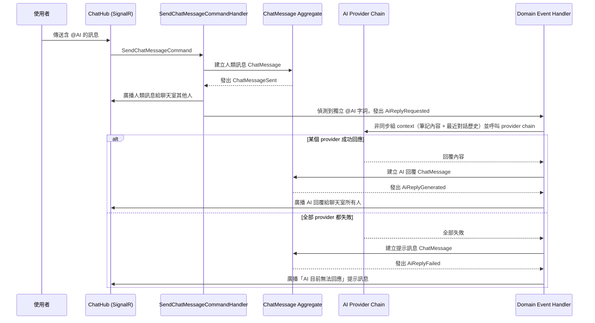

## Context

見 proposal.md 的 Why。建立在 `collab-editing` 已建立的共編者名單（`NoteCollaborator`，屬於 `Note` Aggregate 自身狀態）之上，聊天室的存取範圍直接沿用「擁有者或共編者」這個既有概念。基礎設施面沿用 `setup-infra-and-auth` 建好的 Redis backplane。訂閱等級（ProMax 才能用 AI Chat）本身不在這個 change 處理，這裡假設功能對所有使用者開放，等 `subscription-billing` change 再疊加分級限制。

## Aggregate 邊界

**`ChatMessage`（Notes context 的獨立 Aggregate Root）**：這個 change 新增的 Aggregate，不是 `Note` 底下的子實體。理由：一則聊天訊息的新增（含 `@AI` 觸發、AI 回覆產生）本身沒有任何跟「筆記內容編輯」共用的不變條件——它只是透過 `NoteId` 這個 ID 參照筆記，借用同一套「擁有者或共編者」存取規則，並不需要載入或修改 `Note` Aggregate 本身的狀態。兩者的一致性邊界（consistency boundary）是分開的：`Note` 的不變條件圍繞筆記內容/共編者名單/分享連結，`ChatMessage` 的不變條件圍繞「誰能在這個聊天串裡留言、`@AI` 何時觸發、AI 回覆失敗時要不要留下提示訊息」。把它們分成兩個 Aggregate，可以避免 `Note` 這個已經承擔不少職責的 Aggregate 繼續變大，也讓聊天訊息的高寫入頻率（人類 + AI 訊息都算寫入）不會跟筆記內容的編輯交易綁在一起。

`ChatMessage` 只以 `NoteId`（值）參照 `Note`，不直接持有或操作 `Note` 物件——跨 Aggregate 一律走 ID 參照，這是既有慣例（`Note.OwnerAppUserId` 參照 `AppUser` 也是同樣做法）。

## Domain Events

- **`ChatMessageSent`**（`ChatMessageId`、`NoteId`、`AuthorAppUserId`、`ContainsAiMention`）：任何一則聊天訊息（人類發出）成功儲存並廣播後發出。
- **`AiReplyRequested`**（`NoteId`、`TriggeringChatMessageId`）：偵測到訊息內容含獨立 `@AI` 字詞、決定觸發 AI 產生回覆時發出，作為背景非同步流程的起點。
- **`AiReplyGenerated`**（`ChatMessageId`、`NoteId`、`ProviderUsed`）：AI provider chain 裡有任何一個 provider 成功產生回覆、回覆已存成新的 `ChatMessage` 並廣播後發出。
- **`AiReplyFailed`**（`NoteId`、`TriggeringChatMessageId`）：所有設定的 AI provider 都無法產生回覆，系統改為回覆一則提示訊息時發出。

目前沒有其他 Aggregate/Context 監聽這些事件，先定義出來作為之後可能的擴充點（例如統計哪個 provider 被使用得最多、或未來要做用量計費）。

## Sequence：使用者標記 @AI 觸發 AI 回覆

## Goals / Non-Goals

**Goals:**
- 筆記的擁有者與共編者可以在該筆記的聊天室互相傳訊息、即時看到彼此的訊息。
- 使用者標記 `@AI` 時，系統會產生一則了解聊天歷史與筆記內容的 AI 回覆訊息。
- 設定的 AI provider 無法回應時，系統自動嘗試下一個備援 provider，而不是直接失敗。
- 所有備援都失敗時，使用者會收到明確的提示，而不是無聲沒有回應。

**Non-Goals:**
- 訂閱等級限制（例如「只有 ProMax 才能用聊天室」）——留給 `subscription-billing` change 疊加。
- AI 正在產生回覆時的「輸入中」提示——這次先不做，訊息準備好才會出現。
- 編輯或刪除已送出的聊天訊息。
- 對使用者傳送訊息的頻率做額外限流——沿用一般的 API 存取限制即可，不特別為聊天室加規則。

## Decisions

**1. 聊天室的存取檢查沿用 `collab-editing` 已定案的做法：純 SQL 條件（擁有者或 `NoteCollaborator` 名單內的使用者），不引入授權函式庫。**
跟先前的判斷一致——這裡的「誰能存取」條件跟共編權限完全相同，直接重用同一個查詢邏輯即可。

**2. 新增獨立的 SignalR ChatHub（跟 `collab-editing` 的協作編輯 Hub 分開），一樣以 `NoteId` 當 Group，加入前做相同的存取檢查，沿用同一個 Redis backplane。**
聊天訊息跟即時編輯的 Yjs update 是兩種不同性質的資料流，用獨立的 Hub 分開處理，邏輯上更清楚，也不會互相干擾。

**3. `@AI` 觸發規則：偵測訊息內容中是否包含獨立的 `@AI` 字詞（前後為空白或訊息邊界），避免誤觸發（例如 email 地址裡出現的字串）。**
單純的子字串比對容易誤判，用「整詞匹配」的規則排除掉這類誤觸發。

**4. AI provider 用 Chain of Responsibility：一個 `IAiChatProvider` 介面，多個實作依序排列，前一個回報「無法處理」（例如額度用盡、逾時）就換下一個嘗試，直到有人成功回應或全部嘗試完畢。**
這是先前探索階段就定案的模式——多個免費額度 provider，額度用盡時自動換下一個。

**5. 送給 AI 的 context 包含「最近一段聊天對話歷史」與「這篇筆記目前的完整內容」。**
讓 AI 能回答跟筆記內容相關的問題，體驗上更完整；但這代表筆記內容會被送到第三方 AI provider，這點已經跟你確認過、是刻意接受的取捨（見 Risks）。

**6. AI 回覆是非同步產生的：使用者的訊息先立即儲存並廣播出去，AI 呼叫在背景進行，完成後才把回覆存成一則新的聊天訊息並廣播。**
呼叫外部 AI provider 有明顯的延遲，不應該讓使用者發訊息的當下被卡住等待。

## Risks / Trade-offs

- **[Risk]** 把整篇筆記內容當 context 送給第三方免費額度 AI provider，等於這些內容離開了你自己的基礎設施，可能被對方記錄或用於訓練。→ **Mitigation**：這是你已經確認接受的取捨；玩具/學習專案的定位下可以接受，正式產品化前需要重新評估。
- **[Risk]** 筆記內容很長時，加上聊天歷史，可能超過 AI provider 的 context 長度限制。→ **Mitigation**：送出前對筆記內容做長度截斷，保留前面一段內容即可，這是可接受的簡化。
- **[Risk]** 免費額度 AI provider 的回應時間可能不穩定，使用者發了 `@AI` 之後可能要等一陣子，且沒有任何「正在處理中」的提示。→ **Mitigation**：這次刻意不做這個提示（見 Non-Goals），是接受的體驗取捨。
- **[Risk]** 所有備援 provider 都失敗時，如果沒有明確處理，使用者會以為系統沒反應。→ **Mitigation**：規格裡明確要求這種情況要回一則提示訊息，而不是靜默失敗。
