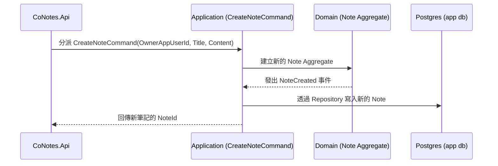

## Context

見 proposal.md 的 Why。這個 change 建立在 `setup-infra-and-auth` 已完成的 `identity/authentication` 之上——每個已驗證的使用者都已經有對應的 `AppUser` 記錄可以掛資料。資料存取一律走 Dapper 直接對 Postgres 下 SQL。

**Aggregate 邊界**：`Note` 是這個 change 唯一的 Aggregate Root。「只有擁有者能讀取/更新/刪除」這條不變條件封裝在 `Note` 本身（建立時記錄 `OwnerAppUserId`，任何變更行為都要先載入這個 Aggregate 再檢查擁有權），不獨立拆出一個「權限」Aggregate——目前唯一的規則就是「擁有者比對」，沒有複雜到需要另立 Aggregate。`AppUser`（Identity context）只用 `OwnerAppUserId` 這個 ID 被參照，不跨 Aggregate 直接操作。

**Domain Event**：
- `NoteCreated`：`Note` 首次建立成功時發出，附帶 `NoteId`、`OwnerAppUserId`。
- `NoteDeleted`：`Note` 被刪除時發出，附帶 `NoteId`。
目前沒有其他 Aggregate/Context 監聽這兩個事件，但先定義出來，讓之後 `note-linking`（筆記被刪除時要連帶清連結）等 change 有現成的掛鉤點可用。

## Goals / Non-Goals

**Goals:**
- 使用者可以建立、讀取、更新、刪除自己的筆記。
- 非擁有者無法讀取或修改別人的筆記。
- 資料表設計不會擋住之後 `collab-editing` change 要加的共享編輯功能。

**Non-Goals:**
- 共享編輯／多人協作（`collab-editing` change 的範圍）。
- 訂閱等級限制（例如限制免費版能建立的筆記數量）——這屬於 `subscription-billing` change，這裡先不擋。

## Sequence：建立筆記

## Decisions

**1. 擁有權檢查用簡單的查詢條件（`WHERE OwnerAppUserId = @currentUserId`），不引入任何授權函式庫。**
目前只有「擁有者」一種關係，沒有共編者名單，用 SQL 條件過濾就足夠，不需要提前引入之前討論過的 Casbin/OpenFGA 這類授權引擎——那個決策留到真的有多人共編關係時（`collab-editing`）再做。

**2. `Note` table 只存單一擁有者外鍵（`OwnerAppUserId`），不建共編者的關聯表。**
現階段沒有共編需求，先不建這個關聯表。之後 `collab-editing` 要加共享編輯時，是新增一張 `NoteCollaborator` 關聯表，不需要更動 `Note` 這張表本身的擁有者欄位——擁有者跟共編者是兩個獨立概念，這樣的表設計不會擋到後面擴充。

**3.（更新：改採專案統一的 CQRS 慣例）Application 層依 `openspec/config.yaml` 的規則分 Command／Query 兩條路徑：建立/更新/刪除走 Command + Handler（經 `Note` Aggregate、Repository 落地），列表/讀取走 Query + Handler（直接用 Dapper 查詢組 Read Model，不經過 Domain 層）。**
這是專案層級的統一慣例（所有 change 都採用），不是這個 capability 特別需要的複雜度——單一 `Note` 資源本身仍然很單純，Command/Query 的拆分只是讓 Application 層的資料夾/類別命名跟其他 change 一致，不代表要引入事件溯源或讀寫分離的資料庫等更重的 CQRS 實作。

**4. Schema 變更透過新的 `golang-migrate` migration 檔案新增 `Note` table，外鍵指向 `AppUser(Id)`。**
延續 `setup-infra-and-auth` 已定案的 migration 機制。

## Risks / Trade-offs

- **[Risk]** 刪除筆記是直接硬刪除，沒有軟刪除/復原機制。→ **Mitigation**：現階段玩具規模可以接受；之後如果想要復原功能，是新增欄位（如 `DeletedAt`）的加法式變更，不會動到現有 schema。
- **[Risk]** 目前的擁有權檢查邏輯（SQL 條件過濾）分散在各個 endpoint 裡，如果之後共編關係變複雜，容易重複程式碼。→ **Mitigation**：`collab-editing` change 再視情況決定要不要抽出共用的授權檢查邏輯，這裡不提前做。
