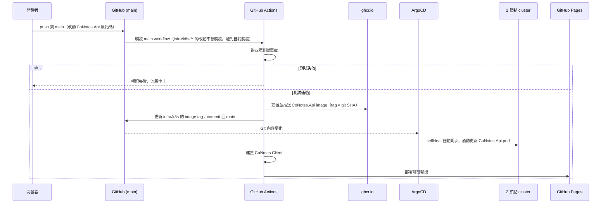

## Context

見 proposal.md 的 Why。這個 change 是純工具鏈/部署流程變更，不涉及 DDD 的 Aggregate 邊界或 Domain Event（因此沒有「Aggregate 邊界」小節）——但仍然畫出完整的流程圖，說明這條 pipeline 實際怎麼運作。建立在既有的 `infra/argocd/application.yaml`（`prune: true` + `selfHeal: true`）跟 `sample/` 範本裡四個測試專案的慣例之上。

## Goals / Non-Goals

**Goals:**
- PR 階段自動跑完整測試（四種測試專案），不通過不能合併。
- push 到 main 後，自動建置 `CoNotes.Api` image、推送、更新部署 manifest，讓 ArgoCD 自動同步上線。
- `CoNotes.Client` 的靜態輸出自動部署到 GitHub Pages。
- 密鑰完全不進 CI/CD 流程、也不進 git，維護方式對之後重建環境的人是清楚可查的。

**Non-Goals:**
- 密鑰的加密/自動化管理（Sealed Secrets、SOPS 等）——你已經決定用伺服器端 `.env` + 手動腳本，這個 change 不做更自動化的方案。
- 多環境部署（staging/production 分離）——目前只有一個 2 節點 cluster，一個環境。
- 自動回滾機制——目前的回滾手段沿用 `setup-infra-and-auth` 已定案的做法（ArgoCD `prune`/`selfHeal` + 手動修正）。

## Sequence：從 push 到 main 到上線

## Decisions

**1. PR 跟 main 用兩個獨立的 workflow：PR 只跑測試，main 才建置+推送+部署。**
避免每次 PR 的 commit 都去建置/推送 image，浪費資源也沒必要——只有真的要合併進 main 的程式碼，才值得推一個 image 版本。

**2. main workflow 的觸發條件排除 `infra/k8s/**` 路徑的改動。**
因為這個 workflow 自己會 commit 回 `infra/k8s` 的 image tag，如果不排除，會造成「build → commit → 觸發 build → commit → ...」的無窮迴圈。

**3. Image tag 用 git SHA，不是 `latest`。**
`latest` 沒有辨識度，出問題時不知道部署的到底是哪個版本；用 SHA 當 tag，`infra/k8s` 裡的 manifest 內容本身就直接對應到一個確切的 commit，方便追查。

**4. Image registry 選 ghcr.io。**
跟 repo 在同一個平台，GitHub Actions 用內建的 `GITHUB_TOKEN` 就能推送，不用額外申請帳號或存 registry 密碼。

**5. 密鑰完全不進 CI/CD、不進 git：維護一份伺服器端的 `.env` 檔案，用 `scripts/apply-secrets.sh` 手動套用成 k8s Secret。**
這是你的決定。比起 Sealed Secrets，不用多裝一個 controller，維運元件數更少；代價是密鑰的來源只存在於伺服器端這一份檔案，環境沒辦法單靠 git 100% 重建——這個取捨在下面 Risks 說明。

**6. 部署 manifest 的更新用 CI 直接 commit 回 main，不用 ArgoCD Image Updater。**
Image Updater 是另一個要裝進 cluster 的 controller，在 2 節點的資源限制下，CI 直接改 git 內容更輕量，也符合現有「一切經過 git 才生效」的 GitOps 慣例。

## Risks / Trade-offs

- **[Risk]** 密鑰只存在伺服器端 `.env` 檔案，如果那台伺服器/節點資料遺失，密鑰就一併遺失，無法從 git 重建。→ **Mitigation**：這是選擇不加密進 git 的必然代價；建議你自己把 `.env` 內容備份在密碼管理工具之類的地方，這是操作紀律問題，不是這個 change 能解決的技術問題。
- **[Risk]** CI 用 `GITHUB_TOKEN` commit 回 main，需要在 repo 設定裡開啟 Actions 的寫入權限，沒開會導致 workflow 靜默失敗在最後一步。→ **Mitigation**：tasks.md 裡列一個明確驗證步驟，確認這個權限有正確設定。
- **[Risk]** API 的 image 部署跟前端的 GitHub Pages 部署是兩個獨立步驟，中間有時間差——短暫時間內可能出現前端版本跟後端版本不完全對應的情況。→ **Mitigation**：這個規模下可以接受，不特別做兩者同步上線的機制。
