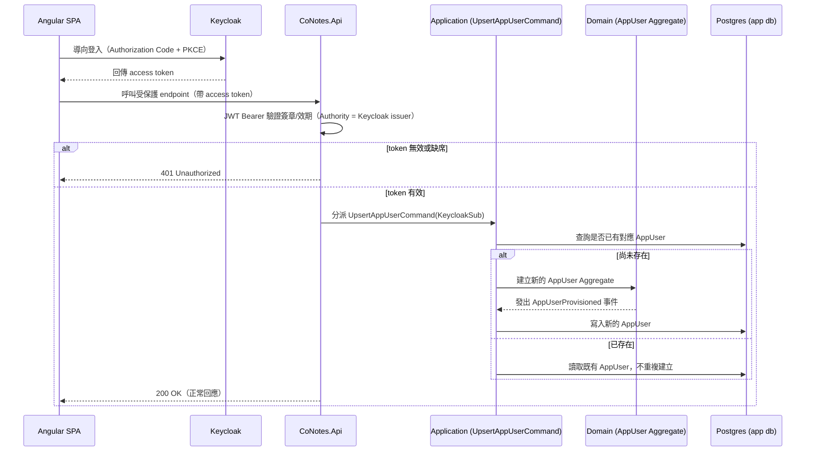

## Context

見 proposal.md 的 Why。目前狀態：cluster 只有一個指向空 `deploy/k8s` 的 ArgoCD `Application`——還沒有任何 workload。限制條件：2 節點 cluster（餘裕有限）、Cloudflare Tunnel 是唯一的 ingress 路徑、玩具/學習專案（非商業）、後端技術棧已定為 .NET 10 + Dapper + Postgres。

## Goals / Non-Goals

**Goals:**
- Angular SPA 可以對 Keycloak 完成登入，並帶著有效的 access token 呼叫 API。
- API 會驗證這個 token，拒絕沒帶 token 的請求。
- 每個通過驗證的使用者，在應用程式自己的 Postgres 裡都有一筆對應的 `AppUser` 記錄，讓後面階段（筆記歸屬、訂閱等級）可以掛資料上去。
- 應用程式資料庫的 schema 變更透過 `golang-migrate` 做版本控管、可重複執行。
- API 的 trace 跟 log 可以在 SigNoz 裡看到。

**Non-Goals:**
- 訂閱等級／授權邏輯（後面的 change）。
- 筆記、共編、AI Chat、金流（後面的 change）。
- Keycloak 高可用性或多副本——在這個規模下先接受單副本（見 Risks）。

## Aggregate 邊界

**`AppUser`（Identity context 的 Aggregate Root）**：代表「這個人在我們系統裡是誰」——只包含識別碼（Keycloak `sub` claim）跟建立時間，不包含任何產品資料。

`AppUser` 跟「Keycloak 裡的使用者」是刻意分開的兩個概念，不是同一個 Aggregate：Keycloak 的使用者記錄屬於外部身份提供者，我們不擁有、也不管理它的生命週期（無法透過我們的 Domain 邏輯建立/刪除 Keycloak 使用者）；`AppUser` 才是我們自己系統裡的 Aggregate，透過 Keycloak `sub` claim 跟外部身份對應。之所以要有這層邊界，是因為後面的 Notes、Billing 等 context 都需要一個「屬於我們自己、我們能演化」的使用者身份可以掛外鍵，不能直接依賴 Keycloak 的內部使用者模型（那是別人的系統，我們不該假設它的結構穩定不變）。

`AppUser` 目前是一個很薄的 Aggregate（沒有內部 Entity/Value Object），但保留獨立 Aggregate 的理由是：之後 `subscription-billing` change 會在它身上加 `PlanTier` 欄位、`Notes`/`Billing` context 會用它的 Id 當外鍵——它是多個 context 共同依賴的穩定身份錨點，值得從一開始就當一個明確的 Aggregate 對待，而不是散落在各處的一個資料表。

## Domain Events

- **`AppUserProvisioned`**（`AppUserId`、`KeycloakSub`、`OccurredAt`）：第一次為某個 Keycloak 身份建立 `AppUser` 記錄時發出。這個 change 本身沒有任何監聽者，是刻意先定義出來給之後的 context 掛勾子用（例如未來若要在使用者第一次登入時做歡迎信、初始化預設資料等，都可以監聽這個事件而不用修改 Identity context 本身）。

## Sequence：使用者登入並取得 AppUser 記錄

## Decisions

**1. Keycloak 用純 Deployment + Service 部署，不用 Operator。**
Keycloak 官方維護一個 Operator（透過 OLM 安裝），但沒有官方 Helm chart。Operator 的價值在於自動化生命週期管理（滾動升級、HA 拓樸）——以單副本、2 節點的玩具規模來說用不到，還會多裝 CRD 跟一個 controller pod。純 Deployment/Service 的元件數更少。取捨見下方 Risks。

**2. 共用同一個 Postgres instance，切兩個 database（`app`、`keycloak`）。**
在已經吃緊的 2 節點上，為了 Keycloak 再開一個 Postgres instance，是重複建置一個 stateful workload，這個規模下沒有實質效益。用獨立的 *database*（不只是 schema）讓 Keycloak 的資料未來要搬去自己的 instance 時，可以直接切開。

**3. 一個 Keycloak Realm，一個 public client（開 PKCE），給 Angular SPA 用。**
SPA 是 public client（瀏覽器程式碼裡藏不住任何 secret），Authorization Code + PKCE 是業界對這個問題的標準解法。目前不建立 confidential client——現階段沒有任何伺服器端邏輯需要代替使用者當 OIDC client。

**4. 前端 OIDC 函式庫用 `keycloak-angular`。**
相較於更通用、跟 provider 無關的 `angular-oauth2-oidc`，選它是因為它是 Keycloak 慣用的 adapter，串接的 glue code 更少。取捨：如果未來真的要換掉 Keycloak，耦合度會稍微高一點——目前沒有換掉的計畫，這個取捨可以接受。

**5. API 是純粹的 OIDC Resource Server，用 ASP.NET Core 內建的 JWT Bearer handler。**
`AddAuthentication().AddJwtBearer()`，`Authority` 設成 Keycloak 這個 Realm 的 issuer URL，`Audience` 設成 SPA 的 client id。這個 middleware 會自動抓 Keycloak 的 JWKS 來驗證 token 簽章——不用自己寫任何 token 驗證邏輯。這是 Microsoft 官方文件針對外部 OIDC issuer 的標準做法（[Configure JWT bearer authentication in ASP.NET Core](https://learn.microsoft.com/en-us/aspnet/core/security/authentication/configure-jwt-bearer-authentication)）。API 完全不處理帳密或登入交握。

**6. 影子 `AppUser` 記錄，用 Keycloak 的 `sub` claim 當 key，第一次驗證通過時 upsert。**
Keycloak 只負責身份（誰登入了），不該擁有產品資料（訂閱等級、筆記歸屬）——這個先前已經談定的分工，需要一筆 App 端的使用者記錄來掛資料。曾考慮把產品資料存成 Keycloak 使用者的自訂屬性——但這樣會把 IdP 資料跟產品資料綁在一起，之後在 Postgres 裡要跟 `Notes`／`Subscriptions` 這些 table join 會很彆扭，所以否決。

**7. Schema migration 用 `golang-migrate` CLI，版本化的 `.sql` 檔案存進 repo。**
Dapper 沒有像 EF Core 那樣內建的 migration 機制，手動跑 SQL script 又沒有版本追蹤跟 rollback 機制。`golang-migrate` 是一個獨立的 CLI，直接對純 SQL 檔案操作，跟用哪個 ORM 無關。

**8. SigNoz 作為單一觀測性部署；API 直接把 OTLP 資料送過去。**
這是先前探索階段就定案的——一套部署涵蓋 trace、log、metric，不用分開部署 Grafana/Loki/Tempo/Prometheus。

**9. 用 nginx（ingress-nginx）當 cluster 內的反向代理／Ingress 進入點，Cloudflare Tunnel 只指向這一個 Service。**
這裡補上一個原本設計沒考慮到的缺口：Keycloak 的登入是瀏覽器導向流程（redirect-based），瀏覽器要能直接打到 Keycloak，不能只透過 API 轉發——所以 Keycloak 也需要一個對外網域（`auth.<domain>`），不只 API 的 `api.<domain>`。與其讓 `cloudflared` 直接對應多個內部 Service，改用 nginx 當單一入口，依 hostname（`api.<domain>` → API Service，`auth.<domain>` → Keycloak Service）做路由，`cloudflared` 只需要指向 nginx 這一個目標。曾考慮讓 Cloudflare Tunnel 直接設定多組 hostname 對應多個內部 Service（Tunnel 本身就支援）——這樣可以不用 nginx，但既然你想用 nginx 練這塊，用它當 Ingress Controller 也是很標準的 k8s 模式，之後要加更多對外服務（例如未來階段的其他 UI）只要加 Ingress 規則，不用去改 Tunnel 設定。

**10. Keycloak 的 Realm/Client 設定，寫成 realm-export JSON 存進 repo。**
跟既有的 ArgoCD GitOps 模式一致——設定可重現、可審查，不用每次重建環境都手動點一次 Keycloak 後台。取捨：需要多一步，把手動設定過一次的結果匯出成檔案。

## Risks / Trade-offs

- **[Risk]** 單副本 Keycloak（沒有 Operator、沒有 HA）是單點故障——它掛掉之後沒人能登入（尚未過期的既有 access token 還是能正常呼叫 API）。→ **Mitigation**：這個規模下可以接受；未來要換成 Operator 時，SPA/API 依賴的 OIDC 合約（issuer URL、client id）不會變，所以是一條不破壞相容性的升級路徑。
- **[Risk]** Keycloak 跟 App 共用同一個 Postgres instance/故障域——這個 instance 掛掉會同時拖垮登入跟 App 資料。→ **Mitigation**：用獨立的 database（不是 schema），未來要切到獨立 instance 只是搬資料，不用改資料模型。
- **[Risk]** Public client + PKCE 代表 token 存在瀏覽器裡，沒有 client secret 撐腰，比 confidential client 流程更容易受 XSS 影響。→ **Mitigation**：這是所有 SPA 都要接受的標準取捨；把 access token 效期設短，並依賴 `keycloak-angular` 預設的 refresh token 處理，不要自己刻 token 儲存邏輯。
- **[Risk]** `golang-migrate` 需要人工紀律——不像 EF Core 會從 model 變更自動產生 migration。→ **Mitigation**：留到後面 change 的 CI 設定處理（例如檢查有改 schema 的 PR 是否附上對應 migration 檔）；不影響這個 change。

## Migration Plan

這是從零開始的建置（沒有既有資料），所以這裡的「遷移」指的是部署順序，不是資料遷移：

1. 部署 Postgres → 跑第一版 `golang-migrate` migration，建立 `app` database 的 schema（先只有 `AppUser`）跟空的 `keycloak` database。
2. 部署 Keycloak，指向 `keycloak` database；手動設定一次 Realm 跟 public client，匯出 realm-export JSON 存進 repo，之後都用這份 JSON 匯入。
3. 部署 SigNoz。
4. 部署 .NET 10 API（JWT Bearer 設定指向該 Realm，OTLP 匯出設定指向 SigNoz）。
5. 部署 nginx（ingress-nginx controller），建立 Ingress 規則：`api.<domain>` → API Service、`auth.<domain>` → Keycloak Service。
6. 讓 ArgoCD 的 `Application` 指向已經有內容的 `deploy/k8s`，讓它同步。
7. 在既有的 Cloudflare Tunnel 設定裡，把單一目標指向 nginx 的 Service（不再是分別指向各個內部 Service）。

Rollback：ArgoCD 的 `prune: true` + `selfHeal: true` 代表把 manifests 從 `deploy/k8s` 移除、讓 ArgoCD 重新同步，就會把對應資源撤掉。Postgres 的資料本身不在這個機制的保護範圍內——沒有先備份就不該對它做任何破壞性 rollback，不過這個建置階段的 change 還沒有任何使用者資料需要擔心。

## Open Questions

- 每個 workload 實際的 pod resource requests/limits——留到實作時依照 2 個節點上觀察到的實際用量再調整，不影響上面的做法。
