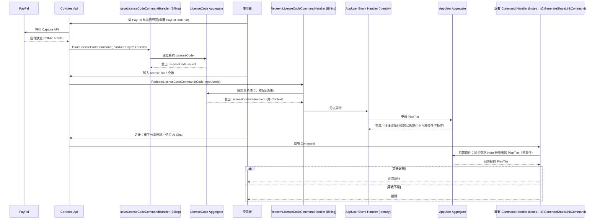

## Context

見 proposal.md 的 Why。建立在 `collab-editing`、`ai-chat` 之上——這兩個 capability 目前對所有使用者開放，這裡要補上訂閱等級檢查。訂閱等級（`PlanTier`）沿用 `setup-infra-and-auth` design.md 早就定案的原則：這類資料活在應用程式自己的 Postgres，不放進 Keycloak token，檢查時即時查詢，不快取。

## Goals / Non-Goals

**Goals:**
- 使用者可以透過 PayPal 訂閱 Pro 或 ProMax，付款成功後取得一組 license code。
- 使用者兌換 code 後，帳號的 `PlanTier` 更新為對應等級，且這個等級是一次性生效、不隨後續 PayPal 扣款狀態自動變動。
- 系統管理者有辦法手動把某個使用者的等級撤銷回 Free。
- `collab-editing` 的分享連結產生、`ai-chat` 的聊天室，都改為檢查筆記擁有者目前的 `PlanTier`。

**Non-Goals:**
- 用 PayPal 的訂閱/定期扣款機制（Subscriptions API）——這裡刻意只用一次性付款（Orders API），PayPal 只當收款工具，不追蹤任何「訂閱」生命週期；也因此完全不用處理續訂、扣款失敗這類事件，只在「這筆付款完成」的當下觸發一次（見 Decisions 2）。
- 用 PayPal webhook 接收付款事件——這台開發機沒有對外可達的網址，PayPal 的伺服器無法把 webhook 送到這裡；改成前端在使用者從 PayPal 核准頁導回後，直接呼叫我們自己的 API 觸發後端呼叫 PayPal 的 Capture API 確認付款狀態（見 Decisions 2）。
- 對已經加入協作/聊天室的共編者做等級檢查——這個 change 只檢查筆記擁有者的等級。
- 使用者自己降級（自助退款、自助退回 Free）——目前只有系統管理者能手動撤銷。

## Aggregate 邊界

**`LicenseCode`（Billing context 的 Aggregate Root，這個 change 新增）**：產生、兌換、防止重複兌換這幾條不變條件都圍繞著這組代碼本身——一組 code 只能被兌換一次、兌換後要記錄是誰兌換的、兌換動作要能查出它對應哪個等級。這些規則跟 `AppUser`（Identity）或任何 `Note`（Notes）都沒有直接關係，`LicenseCode` 是完全獨立的一致性邊界，因此獨立成自己的 Aggregate Root，不是掛在 `AppUser` 底下的子實體。

這個 change 同時**修改**兩個既有 Aggregate 的狀態，但不新增額外的 Aggregate：
- **`AppUser`（Identity context）**：新增 `PlanTier` 欄位。這份狀態的變更不是由 `AppUser` 自己發起，而是被動接受 Billing context 發出的 `LicenseCodeRedeemed` 事件（或管理者撤銷操作）驅動——`AppUser` Aggregate 本身仍然是 `PlanTier` 這份狀態唯一的擁有者與一致性邊界，只是觸發變更的原因來自另一個 Context。
- **`Note`／`ChatMessage`（Notes context）**：既有的 Command Handler（產生分享連結、傳送聊天訊息）在執行前多一道「查詢 Identity context 的 `AppUser.PlanTier`」的前置條件檢查，這是跨 Context 的同步查詢，不修改 `Note`/`ChatMessage` 的內部不變條件本身。

## Domain Events

- **`LicenseCodeIssued`**（`LicenseCodeId`、`PlanTier`、`PayPalOrderId`）：確認 PayPal 一次性付款完成(見下方「PayPal 付款確認方式」)、系統產生一組新 code 時，由 `LicenseCode` Aggregate 發出。
- **`LicenseCodeRedeemed`**（`LicenseCodeId`、`AppUserId`、`PlanTier`，**跨 Context**）：使用者成功兌換一組有效 code 時，由 `LicenseCode` Aggregate（Billing context）發出。**Identity context 訂閱這個事件**，事件處理者把對應 `AppUser` 的 `PlanTier` 更新成事件帶的等級——這是「一次性解鎖、與 PayPal 後續狀態脫鉤」這個決策能夠乾淨落地的關鍵：兌換的當下是唯一會觸發 `AppUser.PlanTier` 變動的時機點，之後不管這筆 PayPal 付款有沒有被退款或申訴爭議，都不會再有任何事件被發出，`AppUser.PlanTier` 自然也就不會被自動改動。
- **`AppUserPlanTierRevoked`**（`AppUserId`）：系統管理者手動撤銷等級時，由 `AppUser` Aggregate（Identity context）直接發出——這個操作本來就發生在 Identity context 內部，不需要跨 Context 事件。

## Sequence：付款、兌換、與跨 Context 的等級檢查

## Decisions

**1. `PlanTier` 直接存在 `AppUser` 上（`Free`/`Pro`/`ProMax`），單一真實來源，每次使用受限功能時即時查詢。**
延續 `setup-infra-and-auth` design.md 就定案的原則：訂閱狀態不進 Keycloak、不快取，即時查詢才能讓等級變動幾乎立刻生效。

**2. PayPal 只用一次性付款（Orders API），不用它的 Subscriptions API；付款完成的確認方式是「使用者從 PayPal 核准頁導回後，後端直接呼叫 PayPal 的 Capture API、檢查回傳狀態是否為 `COMPLETED`」，不是 webhook。License code 兌換生效後不隨這筆付款之後的退款/爭議狀態自動變動。**
兩層決定都是跟你確認過的：(a) 原本規劃走 PayPal 訂閱定期扣款，後來改成單次付款，模型更單純——不需要追蹤任何「訂閱」生命週期，也不需要一張獨立的 `Subscription` table 去記錄扣款狀態，PayPal 的訂單 id 只要附記在觸發它產生的那筆 `LicenseCode` 上，當作稽核用途即可。(b) 原本規劃用 PayPal webhook 接收「付款完成」事件，後來發現這台開發機沒有對外可達的網址、PayPal 伺服器無法真的把 webhook 送到這裡，改成前端在核准後導回我們自己的網站、後端直接呼叫 Capture API 確認——這是 PayPal 標準的 Checkout 流程本來就支援的同步確認方式，不需要額外的公開網址，而且能在本機完整測試。Webhook 原本的價值是「使用者核准後、瀏覽器沒有導回」這種邊角案例的保險，這裡判斷這個風險對玩具/學習專案不重要，先不做。

**3. 系統管理者身份用 Keycloak realm role 判斷（`admin`），不是應用程式自己的欄位。**
這個專案目前完全沒有角色/權限概念，`RequireAuthorization()` 都只檢查「有沒有登入」。撤銷等級這個操作需要區分「誰是管理者」，選擇沿用 Keycloak 既有的 realm role 機制（讀取 JWT 的 `realm_access.roles`），而不是在 `AppUser` 或別的地方另外存一份「是不是管理者」的旗標——避免多一個需要手動同步的真實來源。本機測試時透過 Keycloak Admin Console（或 Admin REST API）手動把 `admin` role 指派給測試帳號。

**4. `LicenseCode` 的兌換不限制兌換者身份——任何登入的使用者輸入一組尚未使用的有效 code，都能把該 code 對應的等級套用到自己的帳號上。**
Code 的性質類似禮品卡：誰有這組碼、誰就能兌換。付款的人跟兌換的人不一定要是同一人（例如可以把碼送給別人），這裡不特別限制。

**5. 撤銷等級是系統管理者的手動操作，把指定使用者的 `PlanTier` 設回 `Free`。**
因為決定 2 讓等級不會自動跟著 PayPal 狀態變動，勢必要有一個獨立的收回手段，這裡選最簡單的方式：手動操作，不做自動化。

**6. `collab-editing` 與 `ai-chat` 的等級檢查，只檢查「筆記擁有者」的 `PlanTier`，不檢查共編者/聊天室參與者自己的等級。**
比照 Google Docs/Notion 這類協作產品的常見模式：付費的是文件擁有者，被邀請進來協作的人不需要自己也是付費使用者。曾考慮「每個參與者都要檢查等級」——否決，這樣會讓「邀請免費版朋友一起編輯」這個核心體驗變得綁手綁腳，也不是這類產品常見的做法。

**7. 擁有者的等級被撤銷或降級後，只會擋住「之後」的受限動作（例如不能再產生新的分享連結、`@AI` 不會再回應），不會回溯移除既有的共編者名單或刪除既有的聊天紀錄。**
降級是「軟性」的——不做破壞性清理，避免使用者資料無預警消失。曾考慮「降級就把共編者全部踢掉、清空聊天記錄」——否決，這種做法對使用者不友善，也不是這個 change 需要處理的急迫問題。

## Risks / Trade-offs

- **[Risk]** 使用者兌換 code 拿到 Pro/ProMax 之後，就算這筆 PayPal 付款之後被退款或申訴爭議，等級也不會自動收回——變成「付一次錢、永久解鎖」的實質效果。→ **Mitigation**：這是你已經確認接受的取捨；管理者手動撤銷是唯一的收回手段；玩具/學習專案定位下可以接受，正式商業化前需要重新設計。
- **[Risk]** License code 兌換不限制身份，一組 code 外流就可能被非付款人搶先兌換。→ **Mitigation**：code 是一次性的，最多被搶兌換一次；這跟禮品卡的性質一致，是可接受的取捨。
- **[Risk]** 完全不知道這筆付款後續是否被退款或申訴爭議(沒有監聽任何 PayPal 事件)。→ **Mitigation**：這是刻意接受的範圍縮減；之後如果需要，可以再加 webhook 監聽其他事件類型，不影響現在的 `LicenseCode` 資料模型。
- **[Risk]** 不用 webhook、改成前端導回後呼叫 Capture 的確認方式，代表如果使用者在 PayPal 核准之後、瀏覽器還沒導回我們網站前就關掉分頁或斷線，這筆付款會停在「已核准但未 capture」的狀態，使用者不會拿到 code。→ **Mitigation**：這是刻意接受的取捨(見 Decisions 2b)——沒有公開網址可以收 webhook，且這個邊角案例對玩具/學習專案影響有限；使用者可以重新走一次付款流程，或未來有公開網址時再補上 webhook 當保險。
